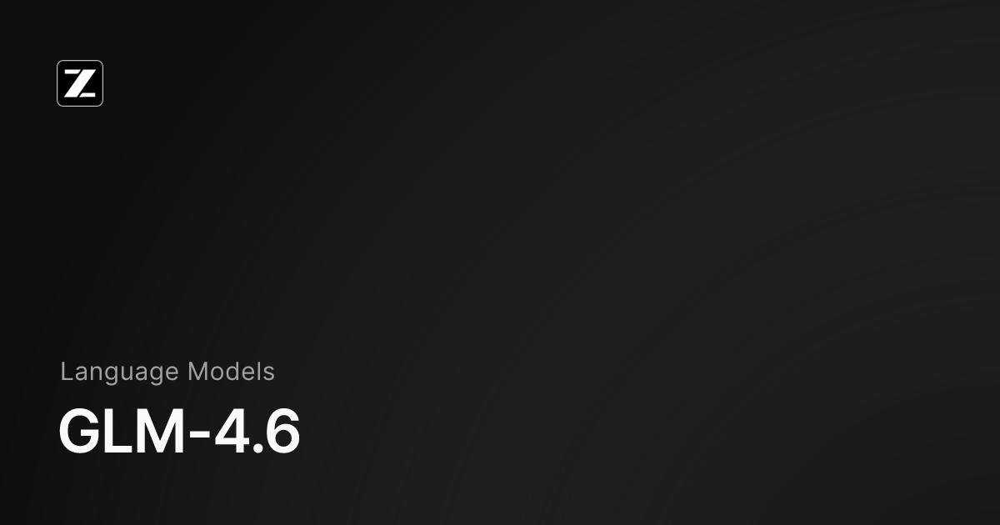

<div align="center">



# <span style="color: #1e3a8a">GLM-4.6 MCP Server</span>

### <span style="color: #10b981">Enterprise Architecture Consultation Protocol</span>

**Model Context Protocol bridge enabling Claude 4.5 Sonnet to leverage GLM-4.6's architectural intelligence for advanced system design, scalability patterns, and technical decision-making.**

[](https://opensource.org/licenses/MIT)
[](https://nodejs.org/)
[](https://www.typescriptlang.org/)

---

</div>

## <span style="color: #1e3a8a">🏗️ System Overview</span>

This MCP server establishes a bi-directional protocol bridge between **Claude 4.5 Sonnet** and **GLM-4.6**, enabling real-time architectural consultation during development workflows. The server exposes GLM-4.6's specialized capabilities through standardized MCP tools, facilitating seamless integration with Warp Terminal's agent infrastructure.

### <span style="color: #10b981">Architectural Capabilities</span>

- **Distributed Systems Design**: Microservices patterns, service mesh architectures, event-driven systems
- **Scalability Engineering**: Horizontal scaling strategies, load balancing, caching hierarchies
- **Security Architecture**: Threat modeling, zero-trust patterns, authentication/authorization frameworks
- **Code Analysis**: SOLID principles evaluation, design pattern recognition, refactoring recommendations
- **Technical Decision Review**: Trade-off analysis, risk assessment, alternative approach evaluation
- **System Architecture Design**: Component decomposition, data flow modeling, technology stack selection

---

## <span style="color: #1e3a8a">⚡ Quick Start</span>

### <span style="color: #10b981">Prerequisites</span>

```bash path=null start=null
node >= 18.0.0
npm >= 9.0.0
GLM-4.6 API Key from https://open.bigmodel.cn
```

### <span style="color: #10b981">Installation</span>

```bash path=null start=null
cd glm-mcp-server
npm install
npm run build
```

### <span style="color: #10b981">Environment Configuration</span>

Create `.env` file in project root:

```bash path=null start=null
GLM_API_KEY=your_api_key_here
```

**Security Notice**: Never commit `.env` to version control. Use secure secret management in production environments.

---

## <span style="color: #1e3a8a">🔧 Warp Terminal Integration</span>

### <span style="color: #10b981">MCP Server Configuration</span>

Add the following configuration to your Warp MCP servers configuration file:

**Location**: `~/.config/warp-terminal/mcp_servers.json` or Warp Settings → MCP Servers

```json path=null start=null
{
  "mcpServers": {
    "glm-architecture": {
      "command": "node",
      "args": ["/absolute/path/to/glm-mcp-server/build/index.js"],
      "env": {
        "GLM_API_KEY": "your_glm_api_key_here"
      }
    }
  }
}
```

**⚠️ Configuration Notes**:
- Replace `/absolute/path/to/glm-mcp-server` with your actual installation path
- Replace `your_glm_api_key_here` with your actual GLM API key
- Restart Warp Terminal after configuration changes

### <span style="color: #10b981">Verification</span>

```bash path=null start=null
# Test server functionality
node build/index.js
# Expected output: "GLM-4.6 MCP Server running on stdio"
```

---

## <span style="color: #1e3a8a">📡 MCP Tools Reference</span>

### <span style="color: #10b981">1. `consult_architecture`</span>

General architectural consultation for system design patterns, scalability strategies, and technical guidance.

**Input Schema**:
```typescript path=null start=null
{
  query: string;        // Architectural question requiring expert consultation
  context?: string;     // Optional system context, requirements, constraints
}
```

**Use Case**: High-level architectural decisions, pattern selection, scalability planning

---

### <span style="color: #10b981">2. `analyze_code_architecture`</span>

Architectural analysis of source code including design patterns, SOLID principles, and improvement recommendations.

**Input Schema**:
```typescript path=null start=null
{
  code: string;         // Source code to analyze
  language: string;     // Programming language (typescript, python, go, java, etc.)
  question: string;     // Specific architectural question about the code
}
```

**Use Case**: Code review, refactoring planning, design pattern evaluation

---

### <span style="color: #10b981">3. `design_system_architecture`</span>

Complete system architecture design from requirements including component breakdown, data flow, and deployment strategies.

**Input Schema**:
```typescript path=null start=null
{
  requirements: string; // Detailed system requirements, constraints, objectives
}
```

**Use Case**: New system design, architecture documentation, technology selection

---

### <span style="color: #10b981">4. `review_technical_decision`</span>

Technical decision review with impact assessment, trade-off analysis, and alternative recommendations.

**Input Schema**:
```typescript path=null start=null
{
  decision: string;     // Technical decision to review
  context: string;      // Current architecture, constraints, objectives
}
```

**Use Case**: Architecture review, technology evaluation, risk assessment

---

## <span style="color: #1e3a8a">🔬 Usage Examples</span>

### <span style="color: #10b981">Example 1: Architectural Consultation</span>

Within Warp Terminal, Claude can invoke:

```typescript path=null start=null
// Claude automatically calls via MCP
consult_architecture({
  query: "What's the optimal caching strategy for a high-traffic API with 10k req/s?",
  context: "Node.js microservices, PostgreSQL database, AWS infrastructure"
})
```

### <span style="color: #10b981">Example 2: Code Architecture Analysis</span>

```typescript path=null start=null
analyze_code_architecture({
  code: `class UserService { ... }`,
  language: "typescript",
  question: "Does this service follow clean architecture principles?"
})
```

### <span style="color: #10b981">Example 3: System Design</span>

```typescript path=null start=null
design_system_architecture({
  requirements: `
    - Real-time messaging platform
    - 1M concurrent users
    - Sub-100ms latency
    - 99.99% uptime SLA
    - Global distribution
  `
})
```

---

## <span style="color: #1e3a8a">🏛️ Architecture</span>

```
┌─────────────────────────────────────────────────────────────┐
│                      Warp Terminal                          │
│  ┌──────────────────────────────────────────────────────┐   │
│  │              Claude 4.5 Sonnet Agent                 │   │
│  └────────────────────┬─────────────────────────────────┘   │
└───────────────────────┼─────────────────────────────────────┘
                        │ MCP Protocol (stdio)
                        ▼
┌─────────────────────────────────────────────────────────────┐
│                  GLM MCP Server (Node.js)                   │
│  ┌──────────────────────────────────────────────────────┐   │
│  │  MCP Protocol Handler  │  Tool Registry              │   │
│  ├──────────────────────────────────────────────────────┤   │
│  │            GLM-4.6 API Client Layer                  │   │
│  │  • Authentication  • Error Handling  • Retry Logic   │   │
│  └──────────────────────────────────────────────────────┘   │
└────────────────────────┬────────────────────────────────────┘
                         │ HTTPS/REST
                         ▼
┌─────────────────────────────────────────────────────────────┐
│          GLM-4.6 API (open.bigmodel.cn)                     │
│              Zhipu AI Model Inference                       │
└─────────────────────────────────────────────────────────────┘
```

---

## <span style="color: #1e3a8a">🛠️ Development</span>

### <span style="color: #10b981">Build</span>

```bash path=null start=null
npm run build      # Compile TypeScript to JavaScript
npm run watch      # Development mode with auto-rebuild
```

### <span style="color: #10b981">Project Structure</span>

```
glm-mcp-server/
├── src/
│   ├── index.ts           # MCP server entry point
│   └── glm-client.ts      # GLM-4.6 API client
├── build/                 # Compiled JavaScript output
├── package.json           # Dependencies and scripts
├── tsconfig.json          # TypeScript configuration
└── .env                   # Environment variables (not in VCS)
```

---

## <span style="color: #1e3a8a">🔐 Security Considerations</span>

- **API Key Management**: Store GLM_API_KEY in environment variables, never in code
- **Transport Security**: All API communications use HTTPS/TLS
- **Input Validation**: All tool inputs are validated before processing
- **Error Handling**: Sensitive information is sanitized from error messages
- **Rate Limiting**: Implement client-side rate limiting for production deployments

---

## <span style="color: #1e3a8a">📊 Performance Characteristics</span>

| Metric | Specification |
|--------|--------------|
| **Latency** | 2-8s (model inference dependent) |
| **Throughput** | API key tier dependent |
| **Timeout** | 60s default (configurable) |
| **Max Token Output** | 4096 tokens |
| **Concurrent Requests** | Single instance: 1 (sequential processing) |

---

## <span style="color: #1e3a8a">🐛 Troubleshooting</span>

### <span style="color: #10b981">Server Not Starting</span>

```bash path=null start=null
# Verify Node.js version
node --version  # Must be >= 18.0.0

# Check build output
npm run build

# Verify GLM_API_KEY is set
echo $GLM_API_KEY
```

### <span style="color: #10b981">API Authentication Errors</span>

- Verify API key validity at https://open.bigmodel.cn
- Check API key has sufficient quota
- Ensure no whitespace in `.env` file

### <span style="color: #10b981">Warp Terminal Integration Issues</span>

- Restart Warp Terminal after configuration changes
- Verify absolute path in MCP configuration
- Check Warp logs: Warp → Settings → Advanced → View Logs

---

## <span style="color: #1e3a8a">📚 Resources</span>

- **GLM-4.6 Documentation**: https://docs.z.ai/guides/llm/glm-4.6
- **Model Context Protocol**: https://modelcontextprotocol.io
- **Warp MCP Integration**: https://docs.warp.dev/features/agent-mode/model-context-protocol

---

## <span style="color: #1e3a8a">📝 License</span>

MIT License - Copyright (c) 2025 CyberLink Security

---

## <span style="color: #1e3a8a">🤝 Support</span>

**Enterprise Support**: info@cyberlinksec.com

**Issue Reporting**: Include server logs, Warp version, and reproduction steps

---

<div align="center">

### <span style="color: #10b981">Built with Enterprise Standards by CyberLink Security & Raptor Labs</span>

**Empowering AI-Driven Architecture Decision Intelligence**

</div>
